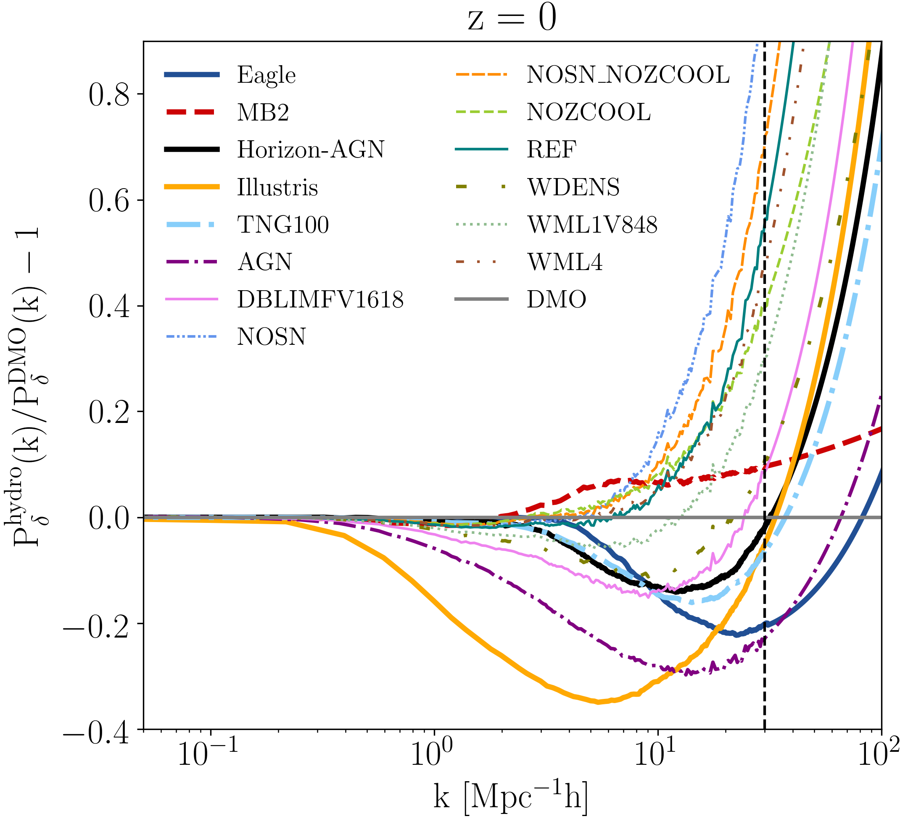

## Baryon power spectrum 

Baryon power spectra ratios between hydrodynamical and dark-matter-only simulations.

Data release of publications: [arXiv:1809.01146](https://arxiv.org/abs/1809.01146) and [arXiv:2007.15026](https://arxiv.org/abs/2007.15026).

 &emsp; &emsp; &emsp; &emsp; 

- The computation of power spectra from simulation snapshots of the [Eagle](http://icc.dur.ac.uk/Eagle/), [Illustris](https://www.illustris-project.org), [Illustris-TNG](https://www.tng-project.org), [MassiveBlack-II](https://arxiv.org/abs/1402.0888) simulations is detailed in the Appendix A of [Huang+18](https://arxiv.org/pdf/1809.01146.pdf).

- The interpolation method of P_hydro(k,z)/P_dmo(k, z) for k > 10 $h^{-1}$Mpc is described in detail in the Appendix B of [Huang+18](https://arxiv.org/pdf/1809.01146.pdf).

### References
- The BAHAMAS, cosmo-OWLS ANG power spectra ratios are re-constructed from http://powerlib.strw.leidenuniv.nl .
- The Horizon-AGN P(k) ratio is re-constructed from https://www.horizon-simulation.org/data.html .
